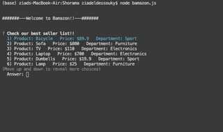
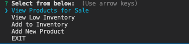
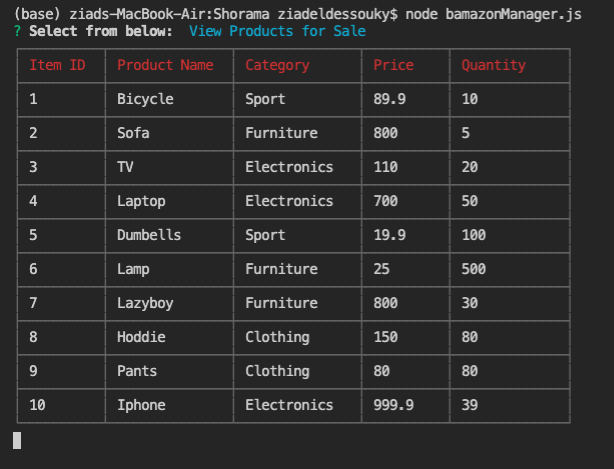
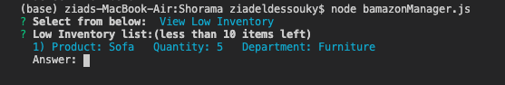

# Shorama

**Bamazon-Client**

  

**Bamazon-Manger**

**Manager Menu**

  

**View-Sale**

  

**View Low Inventory (under 10 pieces in stock)**

  

**Adding to Inventory**
<h>as shown below the total quantity is updated after adding<h>

  

**Adding Product**

  

